# 🗺️ KamDental Email Framework Roadmap

**Vision:** Transform the Microsoft MCP server into a comprehensive email styling framework that produces consistently professional, branded reports for KamDental practice analytics.

## 🔄 Workflow Integration

### **Real-World Usage Pattern**
This framework integrates seamlessly with your existing Claude project workflow for KPI analysis:

```mermaid
flowchart TD
    A[📊 Claude Project Analyzes Spreadsheet Data] --> B[🧠 LLM Outputs Structured Content]
    B --> C[🔧 MCP Tool Processes Data]
    C --> D[📧 Professional Email Generated]
    
    B2["{<br/>  'summary': '$16,656 behind goal, critical phone issue',<br/>  'metrics': [<br/>    {'label': 'MTD Production', 'value': '$143,343', 'status': 'behind'},<br/>    {'label': 'Collections', 'value': '$107,113', 'status': 'neutral'}<br/>  ],<br/>  'alerts': [<br/>    {'type': 'critical', 'message': 'Call answer rate 69.3% vs 85% goal'}<br/>  ],<br/>  'recommendations': [<br/>    {'priority': 'IMMEDIATE', 'title': 'Phone Coverage', 'outcome': '$13K+'}<br/>  ]<br/>}"]
    
    C2[🎨 Framework Instantly Creates:<br/>• Professional HTML email<br/>• Component styling<br/>• Theme-appropriate colors<br/>• Executive signature<br/>• Responsive design]
    
    B --> B2
    C --> C2
```



### **Step-by-Step Integration**

**1. LLM Analysis Phase** 📊
```
Your Claude project analyzes KPI spreadsheets and outputs structured data
```

**2. Structured Data Output** 🧠
```json
{
  "email_type": "practice-report",
  "theme": "baytown", 
  "summary": "$16,656 behind goal, critical phone issue",
  "metrics": [
    {"label": "MTD Production", "value": "$143,343", "status": "behind", "subtitle": "89.6% to goal"},
    {"label": "Collections", "value": "$107,113", "status": "neutral", "subtitle": "74.7% ratio"},
    {"label": "Case Acceptance", "value": "35.86%", "status": "good", "subtitle": "Strong performance"},
    {"label": "Call Answer Rate", "value": "69.3%", "status": "critical", "subtitle": "Below 85% goal"}
  ],
  "alerts": [
    {"type": "critical", "icon": "🚨", "message": "Call answer rate at 69.3% vs 85% goal - losing 16% of potential revenue"}
  ],
  "recommendations": [
    {
      "priority": "IMMEDIATE",
      "title": "Phone Coverage Improvement", 
      "details": "• Target 85% answer rate by month-end\n• Implement dedicated coverage during peak hours",
      "outcome": "Expected outcome: $13,000+ additional production"
    }
  ],
  "providers": [
    {"name": "Dr. Obinna Ezeji", "role": "Leading producer", "production": "$68,053", "goal": "75.6% to goal", "status": "good"},
    {"name": "Adriane (DHAA)", "role": "Excellent performance", "production": "$21,418", "goal": "89.2% to goal", "status": "good"}
  ]
}
```

**3. MCP Tool Processing** 🔧
```python
# Your enhanced MCP tool call
send_practice_report(
    account_id="your-account-id",
    to="team@kamdental.com",
    subject="Baytown Practice Report - MTD July 2025",
    report_data=structured_data_from_claude,  # ← JSON from step 2
    auto_send=True
)
```

**4. Instant Professional Output** 📧
The framework automatically:
- ✅ Parses your structured data
- ✅ Applies Baytown theme (blue colors)
- ✅ Creates metric cards with status colors
- ✅ Generates alert banners with appropriate urgency
- ✅ Builds recommendation cards with priority badges
- ✅ Includes provider performance lists
- ✅ Adds your executive signature
- ✅ Ensures mobile responsiveness
- ✅ Maintains brand consistency

### **Business Value**
- **⚡ Speed**: 30-second email creation vs 30+ minutes manual formatting
- **🎯 Consistency**: Every email follows the same professional standards
- **📱 Responsive**: Perfect rendering on all devices and email clients
- **🎨 Brand Alignment**: Automatic theme selection maintains brand identity
- **📊 Data-Driven**: Direct integration with your analytics workflow
- **🔄 Scalable**: Same process works for all locations and report types

## 🎯 Strategic Overview

### Current State ✅
- ✅ Basic HTML email formatting working
- ✅ Executive signature integration
- ✅ Force HTML content type
- ✅ Professional email template structure
- ✅ Visual mockups completed (`docs/visual-mocks.html`)

### Target State 🎯
- 🎯 Component-based CSS framework
- 🎯 Theme system (Baytown, Humble, Executive)
- 🎯 Pre-built email templates
- 🎯 Dynamic template selection
- 🎯 Data-driven report generation

---

## 📋 Implementation Phases

### **Phase 1: CSS Framework Foundation** 
*Timeline: Week 1-2*

#### 1.1 Create CSS Framework Structure
```
src/microsoft_mcp/email_framework/
├── core/
│   ├── variables.css      # CSS custom properties
│   ├── base.css          # Reset and base styles
│   └── utilities.css     # Helper classes
├── components/
│   ├── metrics.css       # Metric cards and grids
│   ├── providers.css     # Provider performance lists
│   ├── alerts.css        # Alert banners
│   └── recommendations.css # Action item cards
├── themes/
│   ├── baytown.css       # Baytown theme (blue primary)
│   ├── humble.css        # Humble theme (purple primary)
│   └── executive.css     # Executive theme (dark/minimal)
├── templates/
│   ├── practice-report.html   # Single practice template
│   ├── executive-summary.html # Multi-location template
│   └── provider-update.html   # Individual provider template
└── kamdental-email.css   # Compiled complete framework
```

#### 1.2 Framework Integration Points
- [ ] **CSS Compiler**: Create build script to combine all CSS files
- [ ] **Template Engine**: Python template system for dynamic content
- [ ] **Component Factory**: Functions to generate HTML components
- [ ] **Theme Selector**: Logic to choose appropriate theme

#### 1.3 Core Components Implementation
Based on `visual-mocks.html`, implement:

**Metric Cards**
```python
def create_metric_card(label: str, value: str, subtitle: str, status: str = "normal"):
    return f'''
    <div class="metric-card">
        <div class="metric-label">{label}</div>
        <div class="metric-value status-{status}">{value}</div>
        <div class="metric-subtitle">{subtitle}</div>
    </div>
    '''
```

**Provider Lists**
```python  
def create_provider_item(name: str, role: str, production: str, goal: str, status: str):
    return f'''
    <div class="provider-item">
        <div class="provider-info">
            <h4>{name}</h4>
            <div class="provider-role">{role}</div>
        </div>
        <div class="provider-stats">
            <div class="provider-production status-{status}">{production}</div>
            <div class="provider-goal">{goal}</div>
        </div>
    </div>
    '''
```

**Alert Banners**
```python
def create_alert(message: str, alert_type: str = "info", icon: str = "ℹ️"):
    return f'''
    <div class="alert alert-{alert_type}">
        <div class="alert-icon">{icon}</div>
        <div>{message}</div>
    </div>
    '''
```

---

### **Phase 2: Template System** 
*Timeline: Week 3-4*

#### 2.1 Email Template Classes
Create specialized template classes:

```python
class EmailTemplate:
    def __init__(self, theme: str = "baytown"):
        self.theme = theme
        self.css_framework = self.load_framework()
    
    def render(self, data: dict) -> str:
        # Combine framework CSS + template + data
        pass

class PracticeReportTemplate(EmailTemplate):
    def render(self, metrics: dict, providers: list, alerts: list) -> str:
        # Generate practice-specific report
        pass

class ExecutiveSummaryTemplate(EmailTemplate):
    def render(self, locations: list, key_insights: list) -> str:
        # Generate multi-location executive summary
        pass
```

#### 2.2 Template Selection Logic
```python
def select_template(email_type: str, recipient: str, data: dict) -> EmailTemplate:
    """
    Auto-select appropriate template and theme based on:
    - Email type (practice-report, executive-summary, provider-update)
    - Recipient (location-based, executive-level)
    - Data content (metrics, alerts, recommendations)
    """
    
    if "executive" in recipient.lower():
        return ExecutiveSummaryTemplate(theme="executive")
    elif "baytown" in recipient.lower():
        return PracticeReportTemplate(theme="baytown")
    elif "humble" in recipient.lower():
        return PracticeReportTemplate(theme="humble")
    else:
        return PracticeReportTemplate(theme="baytown")  # default
```

#### 2.3 Data Processing Pipeline
```python
class ReportDataProcessor:
    def process_financial_data(self, raw_data: dict) -> dict:
        # Convert raw practice data into template-ready format
        pass
    
    def generate_alerts(self, metrics: dict) -> list:
        # Auto-generate alert banners based on performance thresholds
        pass
    
    def create_recommendations(self, analysis: dict) -> list:
        # Generate actionable recommendations
        pass
```

---

### **Phase 3: MCP Tool Integration** 
*Timeline: Week 5-6*

#### 3.1 Enhanced Email Functions
Update existing MCP tools to use framework:

```python
@mcp.tool
def send_practice_report(
    account_id: str,
    to: str, 
    subject: str,
    financial_data: dict,
    theme: str = "auto",
    template: str = "practice-report"
) -> dict[str, str]:
    """
    IMPORTANT: Send professional practice reports using KamDental email framework.
    Automatically selects appropriate theme and template based on recipient and data.
    
    Args:
        financial_data: Dict with metrics like production, collections, case_acceptance
        theme: "baytown", "humble", "executive", or "auto" (default)
        template: "practice-report", "executive-summary", or "provider-update"
    """
    
    # Process data through framework
    processor = ReportDataProcessor()
    processed_data = processor.process_financial_data(financial_data)
    alerts = processor.generate_alerts(processed_data)
    recommendations = processor.create_recommendations(processed_data)
    
    # Select template
    if theme == "auto":
        template_instance = select_template(template, to, processed_data)
    else:
        template_instance = get_template_class(template)(theme=theme)
    
    # Render email
    html_content = template_instance.render({
        "metrics": processed_data,
        "alerts": alerts, 
        "recommendations": recommendations
    })
    
    # Send using existing infrastructure
    return send_email(account_id, to, subject, html_content)
```

#### 3.2 New Specialized Tools
```python
@mcp.tool  
def send_executive_summary(
    account_id: str,
    to: str,
    locations_data: list[dict],
    period: str = "MTD"
) -> dict[str, str]:
    """Send multi-location executive summary with key insights."""
    pass

@mcp.tool
def send_provider_update(
    account_id: str, 
    to: str,
    provider_name: str,
    performance_data: dict
) -> dict[str, str]:
    """Send individual provider performance update."""
    pass

@mcp.tool
def send_alert_notification(
    account_id: str,
    to: str,
    alert_type: str,
    message: str,
    urgency: str = "normal"
) -> dict[str, str]:
    """Send urgent practice alerts with appropriate styling."""
    pass
```

---

### **Phase 4: Advanced Features** 
*Timeline: Week 7-8*

#### 4.1 Dynamic Content Features
- [ ] **Smart Recommendations**: AI-generated action items based on data patterns
- [ ] **Performance Trends**: Charts and graphs (using CSS/SVG)
- [ ] **Comparative Analysis**: Month-over-month, location comparisons
- [ ] **Goal Tracking**: Visual progress indicators

#### 4.2 Customization System
- [ ] **Brand Customization**: Logo, colors, fonts per location
- [ ] **Layout Options**: Compact vs detailed views
- [ ] **Recipient Preferences**: Save preferred themes/formats
- [ ] **Scheduling**: Automated report sending

#### 4.3 Analytics & Insights
- [ ] **Email Performance**: Open rates, click tracking
- [ ] **Content Optimization**: A/B test different templates
- [ ] **Data Insights**: Practice performance correlation with email engagement

---

## 🛠️ Technical Implementation Details

### Framework Architecture

```python
# src/microsoft_mcp/email_framework/
email_framework/
├── __init__.py
├── core/
│   ├── __init__.py
│   ├── framework.py      # Main EmailFramework class
│   ├── templates.py      # Template base classes
│   ├── components.py     # HTML component generators
│   └── themes.py         # Theme management
├── css/                  # CSS framework files
├── templates/            # HTML templates
└── utils/
    ├── __init__.py
    ├── data_processor.py  # Data transformation
    └── selector.py        # Template/theme selection
```

### Integration with Current Tools

```python
# Update ensure_html_structure() to use framework
def ensure_html_structure(content: str, template_type: str = "default") -> str:
    if template_type == "default":
        # Use current implementation
        return current_ensure_html_structure(content)
    else:
        # Use new framework
        framework = EmailFramework()
        return framework.render(content, template_type)
```

### CSS Framework Loading

```python
class EmailFramework:
    def __init__(self):
        self.css_cache = {}
        self.load_framework()
    
    def load_framework(self):
        """Load and cache CSS framework"""
        css_files = [
            "core/variables.css",
            "core/base.css", 
            "core/utilities.css",
            "components/metrics.css",
            "components/providers.css",
            "components/alerts.css",
            "components/recommendations.css"
        ]
        
        combined_css = ""
        for css_file in css_files:
            with open(f"email_framework/css/{css_file}") as f:
                combined_css += f.read()
        
        self.css_cache["framework"] = combined_css
```

---

## 📊 Success Metrics

### Development Metrics
- [ ] **Framework Size**: <100KB combined CSS
- [ ] **Component Coverage**: 15+ reusable components
- [ ] **Template Variety**: 5+ different email templates
- [ ] **Theme Support**: 3 distinct themes (Baytown, Humble, Executive)

### Quality Metrics  
- [ ] **Email Client Support**: 95%+ compatibility (Outlook, Gmail, Apple Mail)
- [ ] **Mobile Responsive**: 100% mobile-friendly
- [ ] **Load Performance**: <2s render time
- [ ] **Accessibility**: WCAG 2.1 AA compliance

### Business Impact
- [ ] **Consistency**: 100% of emails use framework styling
- [ ] **Development Speed**: 80% reduction in email creation time
- [ ] **Brand Recognition**: Consistent professional appearance
- [ ] **User Engagement**: Improved readability and actionability

---

## 🚀 Quick Wins (Week 1)

### Immediate Implementation
1. **Extract CSS from visual-mocks.html** into separate framework files
2. **Create component generator functions** for metric cards, provider lists, alerts
3. **Update current `ensure_html_structure()`** to optionally use new components
4. **Test framework** with existing email data

### Code Example - Week 1 Deliverable

```python
# Quick integration - add to tools.py
from .email_framework import create_metric_card, create_alert

def generate_practice_email_content(financial_data: dict) -> str:
    """Generate structured practice report using CSS framework"""
    
    # Create metric cards
    metrics_html = f'''
    <div class="metric-grid">
        {create_metric_card("MTD Production", f"${financial_data['production']:,}", 
                           f"{financial_data['production_percent']:.1f}% to goal",
                           "behind" if financial_data['production_percent'] < 100 else "good")}
        {create_metric_card("Collections", f"${financial_data['collections']:,}",
                           f"{financial_data['collection_ratio']:.1f}% ratio")}
        {create_metric_card("Case Acceptance", f"{financial_data['case_acceptance']:.2f}%",
                           "Strong performance", "good")}
    </div>
    '''
    
    # Create alerts
    alerts_html = ""
    if financial_data['production_percent'] < 90:
        alerts_html += create_alert(
            f"Behind goal by ${financial_data['goal'] - financial_data['production']:,}",
            "critical", "🚨"
        )
    
    return f'''
    <div class="email-container theme-baytown">
        <div class="email-header">
            <h3>Practice Report</h3>
            <p>MTD Performance Update</p>
        </div>
        <div class="email-body">
            {alerts_html}
            {metrics_html}
        </div>
    </div>
    '''
```

---

## 🔄 API Consolidation Roadmap (2025)

### Executive Summary

The Microsoft MCP server has grown to **61 API tools** with significant redundancy. This consolidation initiative will reduce the API surface to **46 optimized tools** (25% reduction) while improving maintainability and developer experience.

### Q1 2025: Foundation & Unified Search
**Theme**: "Establish Patterns & Search Unification"

#### Deliverables
- **Unified Search API**: Single `search()` tool replacing 5 separate search implementations
- **Migration Framework**: Automated migration utilities and documentation
- **Foundation Standards**: Standardized parameters, error handling, pagination

#### Technical Specification
```python
@mcp.tool
def search(
    account_id: str,
    query: str,
    types: list[str] = ["message", "event", "driveItem", "contact"],
    folder: str | None = None,
    date_range: dict | None = None,
    has_attachments: bool | None = None,
    file_type: str | None = None,
    limit: int = 20
) -> dict[str, list[dict]]
```

### Q2 2025: Email Operations Consolidation
**Theme**: "Streamline Communication APIs"

#### Deliverables
- **Template Removal**: Eliminate 4 business-specific email templates
- **Generic Template System**: Parameter-driven template engine
- **Email Consolidation**: Merge reply operations and attachment handling

#### Technical Specification
```python
@mcp.tool
def send_email(
    account_id: str,
    to: str,
    subject: str,
    body: str,
    # Enhanced parameters
    template_name: str | None = None,
    template_data: dict[str, Any] | None = None,
    reply_to_id: str | None = None,
    forward_from_id: str | None = None,
    save_as_draft: bool = False,
    cc: list[str] | None = None,
    bcc: list[str] | None = None,
    attachments: list[str] | None = None
) -> dict[str, str]
```

### Q3 2025: File & Attachment Unification
**Theme**: "Streamline Content Management"

#### Deliverables
- **Unified File Management**: Consolidate file operations from 12 to 8 tools
- **Intelligent Caching**: Enhanced performance for frequently accessed files
- **Large File Support**: Chunked operations for files >10MB

### Q4 2025: Migration & Optimization
**Theme**: "Complete Transition & Performance Excellence"

#### Deliverables
- **Complete Migration**: 90% user adoption target
- **Performance Excellence**: System-wide optimization
- **Legacy Deprecation**: 90-day notice periods

### Success Metrics
- **API Count**: 61 → 46 tools (25% reduction)
- **Performance**: ≤5% regression during transition
- **Adoption**: 90% migration within 6 months
- **Maintenance**: 30% reduction in support overhead

### Investment & ROI
- **Budget**: ~$2,400 (AI agent costs: $200/month × 12 months)
- **Additional Costs**: 
  - Microsoft 365 test tenant: ~$20/month × 12 = $240
  - Cloud infrastructure (if needed): ~$100/month × 12 = $1,200
  - **Total**: ~$3,840 for entire consolidation
- **Expected ROI**: 30% maintenance reduction, 25% API surface reduction
- **Resources**: 1 AI agent (Claude) + 1 human supervisor (part-time oversight)

---

## 📝 Next Steps

### Immediate Actions (Email Framework)
1. [ ] Create `src/microsoft_mcp/email_framework/` directory structure
2. [ ] Extract CSS from `visual-mocks.html` into framework files  
3. [ ] Implement basic component generators (metrics, alerts, providers)
4. [ ] Create simple template system
5. [ ] Update one email function to use new framework as proof of concept

### API Consolidation Planning
1. [ ] Review and approve consolidation roadmap
2. [ ] Allocate resources for Q1 2025 start
3. [ ] Begin stakeholder communication
4. [ ] Set up development infrastructure
5. [ ] Initiate unified search design sessions

### Dependencies & Considerations
- **Email Framework**: CSS compatibility, file size, maintenance, testing
- **API Consolidation**: Backward compatibility, performance targets, user migration
- **Resource Planning**: Team formation, budget approval, infrastructure setup
- **Risk Management**: User adoption strategies, performance monitoring

This roadmap provides clear paths for both the email framework enhancement and comprehensive API consolidation! 🚀