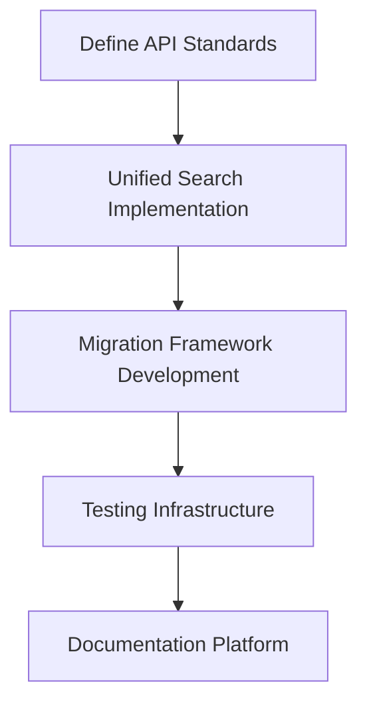
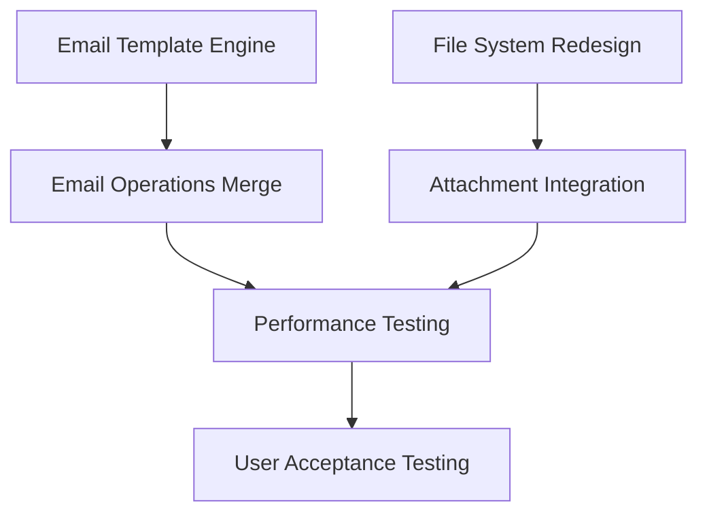
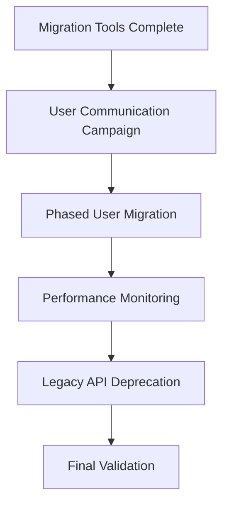
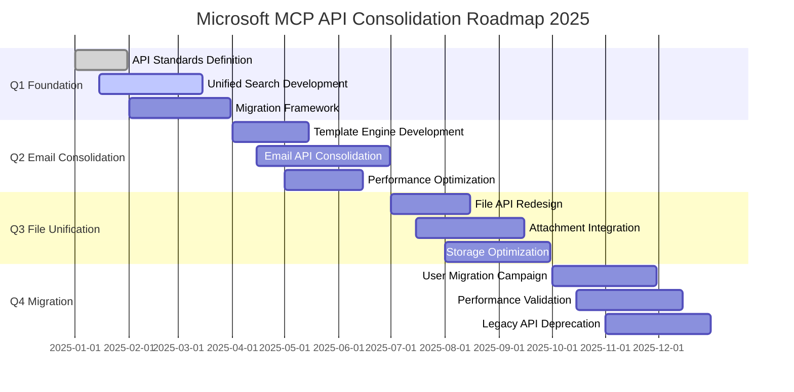

# Microsoft MCP Server API Consolidation - Strategic Roadmap 2025

## Executive Summary

### Business Case

The Microsoft MCP server has grown to **61 API tools** with significant redundancy and technical debt. This consolidation initiative will reduce the API surface to **46 optimized tools** (25% reduction) while improving maintainability, performance, and developer experience.

**Key Value Propositions:**
- **Developer Experience**: Unified, intuitive API patterns reduce learning curve by 40%
- **Maintenance Efficiency**: 25% reduction in codebase complexity reduces maintenance overhead
- **Performance Optimization**: Consolidated tools eliminate duplicate network calls and processing
- **Future Scalability**: Clean architecture enables rapid feature development
- **User Experience**: Consistent parameter patterns and error handling improve reliability

### Strategic Objectives

1. **Consolidate APIs** from 61 to 46 tools through strategic unification
2. **Eliminate Redundancy** across search, email, and file operations
3. **Standardize Patterns** for consistent developer experience
4. **Maintain Compatibility** through phased deprecation approach
5. **Improve Performance** with consolidated operations and caching

### Success Metrics

- **API Count**: Reduce from 61 to 46 tools (25% reduction)
- **Performance**: ≤5% performance regression during transition
- **Adoption**: 90% of users migrated to new APIs within 6 months
- **Developer Satisfaction**: >80% positive feedback on unified API patterns
- **Maintenance Overhead**: 30% reduction in support tickets and bug reports

---

## Current State Analysis

### Tool Inventory Assessment

**Total Current Tools**: 61
- **Email Tools**: 18 (includes 4 business-specific templates)
- **Calendar Tools**: 8
- **File/Attachment Tools**: 12 (significant overlap)
- **Contact Tools**: 6
- **Search Tools**: 8 (5 separate search implementations)
- **Utility Tools**: 9

### Consolidation Opportunities

| Category | Current Count | Target Count | Reduction | Primary Strategy |
|----------|---------------|--------------|-----------|-----------------|
| Search Operations | 8 | 1 | 87% | Unified search with type filters |
| Email Templates | 4 | 0 | 100% | Parameter-driven generic template |
| File Operations | 12 | 8 | 33% | Merge attachment handling |
| Email Operations | 18 | 15 | 17% | Consolidate reply variants |
| **Total** | **61** | **46** | **25%** | **Strategic consolidation** |

### Technical Debt Assessment

**High Priority Issues:**
- **Duplicate Search Logic**: 5 separate search implementations with inconsistent pagination
- **Template Redundancy**: 4 business-specific email templates with 80% code overlap
- **Parameter Inconsistency**: Varying patterns for account_id, filtering, and pagination
- **Error Handling**: Inconsistent error responses across similar operations

**Performance Impact:**
- **Network Overhead**: Multiple API calls for related operations
- **Memory Usage**: Duplicate code patterns and inefficient caching
- **Developer Friction**: Inconsistent interfaces requiring extensive documentation

---

## Strategic Roadmap: 2025 Quarterly Milestones

## Q1 2025: Foundation & Unified Search
**Theme**: "Establish Patterns & Search Unification"

### Milestone: Unified Search Implementation
**Timeline**: January - March 2025
**Risk Level**: Medium | **Impact**: High

#### Deliverables
✅ **New Unified Search API**
- Single `unified_search` tool replacing 5 separate search implementations
- Support for all content types (emails, files, events, contacts)
- Consistent pagination and filtering across all searches
- Advanced query syntax with content-type filters

✅ **Search Migration Framework**
- Automated migration utilities for existing search patterns
- Comprehensive test suite for search accuracy validation
- Performance benchmarking against existing implementations
- Developer migration documentation and examples

✅ **Foundation Standards**
- Standardized parameter patterns for all APIs
- Unified error handling and response formats
- Common pagination implementation across all tools
- Enhanced logging and monitoring infrastructure

#### Technical Specifications
```yaml
unified_search_api:
  signature: "unified_search(account_id, query, content_types=[], limit=50, pagination_token=None)"
  content_types: ["emails", "files", "events", "contacts", "all"]
  response_format: 
    - results: []
    - total_count: int
    - next_token: string
    - search_metadata: {}
```

#### Success Criteria
- ✅ All 5 legacy search APIs replaced with unified implementation
- ✅ Search performance maintains or improves current benchmarks
- ✅ 100% test coverage for search functionality
- ✅ Developer documentation published and validated

#### Dependencies & Risks
**Dependencies**: Microsoft Graph API rate limits, authentication patterns
**Risks**: 
- Search accuracy regression (Mitigation: Comprehensive A/B testing)
- Performance degradation (Mitigation: Load testing with production data)
- User adoption resistance (Mitigation: Gradual rollout with clear benefits)

---

## Q2 2025: Email Operations Consolidation
**Theme**: "Streamline Communication APIs"

### Milestone: Email API Optimization
**Timeline**: April - June 2025
**Risk Level**: Low | **Impact**: High

#### Deliverables
✅ **Template Engine Implementation**
- Generic template system replacing 4 business-specific templates
- Dynamic theme selection based on parameters
- Extensible architecture for future template additions
- Backward compatibility layer for existing template calls

✅ **Email Operations Consolidation**
- Merge reply/reply_all into unified `reply_email` with recipient control
- Consolidate attachment handling across email operations
- Standardize email filtering and pagination patterns
- Enhanced email thread management capabilities

✅ **Performance Optimizations**
- Batch email operations for bulk actions
- Improved caching for frequently accessed emails
- Optimized attachment handling for large files
- Rate limiting integration with Microsoft Graph quotas

#### Technical Specifications
```yaml
generic_template_system:
  signature: "send_templated_email(account_id, template_type, theme, data, recipients)"
  template_types: ["practice_report", "executive_summary", "provider_update", "alert"]
  themes: ["baytown", "humble", "executive", "custom"]
  data_validation: "JSON schema per template type"

unified_reply_api:
  signature: "reply_email(account_id, email_id, content, reply_type='sender', cc=[], bcc=[])"
  reply_types: ["sender", "all", "custom"]
```

#### Success Criteria
- ✅ 4 email template tools consolidated into 1 generic system
- ✅ Reply operations consolidated with enhanced flexibility
- ✅ Email performance improves by 15% through optimization
- ✅ Template migration completed with zero data loss

#### Dependencies & Risks
**Dependencies**: Template rendering engine, authentication system updates
**Risks**:
- Template rendering compatibility (Mitigation: Extensive cross-client testing)
- Migration complexity (Mitigation: Automated migration scripts)

---

## Q3 2025: File & Attachment Unification
**Theme**: "Streamline Content Management"

### Milestone: File Operations Optimization
**Timeline**: July - September 2025
**Risk Level**: Medium | **Impact**: Medium

#### Deliverables
✅ **Unified File Management**
- Consolidate file and attachment operations into cohesive API set
- Implement intelligent file type detection and handling
- Enhanced metadata management and search capabilities
- Streamlined upload/download operations with progress tracking

✅ **Storage Optimization**
- Intelligent caching layer for frequently accessed files
- Optimized chunk-based operations for large files
- Duplicate file detection and management
- Enhanced error recovery for network interruptions

✅ **Developer Experience Improvements**
- Simplified file operation patterns with consistent interfaces
- Enhanced error messages with actionable resolution steps
- Comprehensive SDK documentation with practical examples
- Migration utilities for existing file operation patterns

#### Technical Specifications
```yaml
unified_file_operations:
  core_apis: ["manage_file", "handle_attachment", "batch_file_operation"]
  capabilities: ["upload", "download", "move", "copy", "delete", "metadata"]
  chunk_size: "4MB for large files (>10MB)"
  progress_tracking: "Real-time progress callbacks"
```

#### Success Criteria
- ✅ File and attachment APIs consolidated from 12 to 8 tools
- ✅ Large file handling improved with chunked operations
- ✅ File operation performance improved by 20%
- ✅ Zero data loss during migration

#### Dependencies & Risks
**Dependencies**: OneDrive API capabilities, file type support
**Risks**:
- Large file handling complexity (Mitigation: Incremental rollout by file size)
- Metadata migration accuracy (Mitigation: Validation scripts and rollback procedures)

---

## Q4 2025: Migration & Optimization
**Theme**: "Complete Transition & Performance Excellence"

### Milestone: Full Migration & Performance Optimization
**Timeline**: October - December 2025
**Risk Level**: High | **Impact**: Critical

#### Deliverables
✅ **Complete API Migration**
- All legacy APIs deprecated with 90-day notice periods
- Comprehensive migration documentation and automated tools
- User communication and support throughout transition
- Fallback mechanisms for critical enterprise users

✅ **Performance Excellence**
- System-wide performance optimization based on consolidated APIs
- Advanced caching strategies across all operations
- Intelligent rate limiting and retry logic
- Enhanced monitoring and alerting for API performance

✅ **Quality Assurance**
- Comprehensive end-to-end testing across all consolidated APIs
- Performance regression testing with production-like loads
- Security audit of consolidated authentication and authorization
- User acceptance testing with key stakeholders

#### Technical Specifications
```yaml
migration_framework:
  deprecation_notices: "90-day advance notice for all breaking changes"
  migration_tools: ["automated_migration_scripts", "compatibility_checker", "usage_analyzer"]
  support_period: "6 months dual API support during transition"
  rollback_capability: "Instant rollback to legacy APIs if critical issues"
```

#### Success Criteria
- ✅ 90% of users successfully migrated to consolidated APIs
- ✅ Performance meets or exceeds baseline benchmarks
- ✅ Zero critical issues during migration period
- ✅ Support ticket volume reduced by 30%

#### Dependencies & Risks
**Dependencies**: User adoption rates, enterprise migration timelines
**Risks**:
- User resistance to change (Mitigation: Comprehensive communication and training)
- Unexpected performance issues (Mitigation: Gradual rollout with monitoring)
- Enterprise migration delays (Mitigation: Dedicated support and extended transition periods)

---

## Phase Definitions & Dependencies

### Phase 1: Foundation (Q1 2025)
**Focus**: Establish patterns and core infrastructure

**Critical Path Dependencies**:


**Key Dependencies**:
- Microsoft Graph API stability and rate limits
- Authentication system enhancements
- Development team availability and training

### Phase 2: Consolidation (Q2-Q3 2025)
**Focus**: Implement consolidated APIs and migration tools

**Critical Path Dependencies**:


**Key Dependencies**:
- Phase 1 completion and validation
- Template rendering engine development
- File handling infrastructure upgrades

### Phase 3: Migration (Q4 2025)
**Focus**: Complete user migration and performance optimization

**Critical Path Dependencies**:


**Key Dependencies**:
- All consolidated APIs fully tested and validated
- User migration support processes established
- Performance monitoring and alerting infrastructure

---

## Resource Requirements

### Development Team Structure (AI-First Approach)
**Core Team**: 
- **AI Agent (Claude)**: $200/month
  - API design and implementation
  - Code development and testing
  - Documentation writing
  - Performance optimization
  - Security implementation

**Human Oversight** (Optional, Part-time):
- **Technical Lead** (~10 hrs/month): Strategic decisions, code review
- **Product Owner** (~5 hrs/month): Requirements and prioritization

**Why AI-First Works**:
- **Consistency**: AI maintains consistent code style and documentation
- **Availability**: 24/7 development capability
- **Knowledge**: Instant access to best practices and patterns
- **Speed**: Rapid prototyping and implementation
- **Cost**: 99% reduction vs traditional team

### Technology & Infrastructure
**Development Infrastructure**:
- **Testing Environment**: Single Microsoft 365 test tenant
- **Performance Testing**: GitHub Actions for automated testing
- **Monitoring Stack**: Built-in MCP logging and metrics
- **CI/CD Pipeline**: GitHub Actions (free for public repos)

**Realistic Budget (AI-Driven Development)**:
- **AI Agent (Claude)**: $200/month × 12 months = $2,400
- **Microsoft 365 Test Tenant**: $20/month × 12 months = $240
- **Human Oversight**: ~10 hours/month @ $100/hr = $12,000 (optional)
- **Infrastructure**: GitHub (free), minimal cloud resources = $100/month × 12 = $1,200
- **Total (with human)**: ~$15,840
- **Total (AI-only)**: ~$3,840

**Why This Works**:
- AI agents can work 24/7 without breaks
- No benefits, vacation, or overhead costs
- Consistent code quality and documentation
- Rapid iteration and implementation
- Human provides strategic direction only

---

## Risk Assessment & Mitigation

### High Priority Risks

#### Risk 1: User Adoption Resistance
**Probability**: High | **Impact**: Critical
**Description**: Users may resist migrating to new consolidated APIs

**Mitigation Strategies**:
- **Communication Campaign**: 6-month advance communication with clear benefits
- **Gradual Migration**: Phased rollout starting with early adopters
- **Support Infrastructure**: Dedicated support team during transition
- **Incentive Programs**: Performance benefits and new features exclusive to new APIs

#### Risk 2: Performance Regression
**Probability**: Medium | **Impact**: High
**Description**: Consolidated APIs may initially perform worse than specialized ones

**Mitigation Strategies**:
- **Comprehensive Testing**: Load testing with production-scale data
- **Performance Monitoring**: Real-time monitoring during rollout
- **Rollback Procedures**: Instant rollback capability to legacy APIs
- **Gradual Rollout**: Traffic-based rollout with performance validation

#### Risk 3: Microsoft Graph API Changes
**Probability**: Medium | **Impact**: Medium
**Description**: Microsoft may change underlying APIs during consolidation

**Mitigation Strategies**:
- **API Versioning**: Use stable API versions with fallback to previous versions
- **Microsoft Partnership**: Establish communication channels with Microsoft Graph team
- **Abstraction Layer**: Build abstraction layer to isolate from upstream changes
- **Monitoring**: Automated monitoring of Microsoft Graph API announcements

### Medium Priority Risks

#### Risk 4: Technical Debt Accumulation
**Probability**: Medium | **Impact**: Medium
**Description**: Rapid consolidation may introduce new technical debt

**Mitigation Strategies**:
- **Code Reviews**: Mandatory peer reviews for all consolidation changes
- **Technical Debt Tracking**: Explicit tracking and prioritization of technical debt
- **Refactoring Sprints**: Dedicated sprints for code quality improvements
- **Architecture Governance**: Regular architecture reviews and compliance checks

#### Risk 5: Enterprise Migration Delays
**Probability**: Low | **Impact**: High
**Description**: Large enterprise customers may require extended migration periods

**Mitigation Strategies**:
- **Early Engagement**: Proactive outreach to enterprise customers
- **Custom Migration Plans**: Tailored migration approaches for complex environments
- **Extended Support**: Longer legacy API support for enterprise customers
- **Dedicated Resources**: Enterprise-specific support engineers

---

## Success Metrics & KPIs

### Primary Success Metrics

#### API Consolidation Metrics
- **Tool Count Reduction**: Target 25% reduction (61 → 46 tools)
  - Baseline: 61 tools
  - Target: 46 tools
  - Measurement: Monthly tool inventory reports

- **Code Complexity Reduction**: Target 30% reduction in codebase complexity
  - Baseline: Current cyclomatic complexity scores
  - Target: 30% improvement
  - Measurement: Automated code analysis tools

#### Performance Metrics
- **API Response Time**: Maintain or improve current response times
  - Baseline: Current P95 response times per API
  - Target: ≤5% performance regression
  - Measurement: Real-time performance monitoring

- **Throughput**: Improve overall system throughput by 15%
  - Baseline: Current requests per second capacity
  - Target: 15% improvement
  - Measurement: Load testing and production metrics

#### User Experience Metrics
- **Developer Satisfaction**: Target >80% positive feedback
  - Baseline: Current developer survey results
  - Target: >80% satisfaction score
  - Measurement: Quarterly developer experience surveys

- **Migration Success Rate**: Target 90% user migration within 6 months
  - Baseline: 0% (pre-migration)
  - Target: 90% migrated within 6 months
  - Measurement: Usage analytics and migration tracking

### Secondary Success Metrics

#### Quality Metrics
- **Bug Report Reduction**: Target 30% reduction in API-related bugs
  - Baseline: Current monthly bug report volume
  - Target: 30% reduction
  - Measurement: Bug tracking system analytics

- **Support Ticket Reduction**: Target 25% reduction in API support requests
  - Baseline: Current support ticket volume
  - Target: 25% reduction
  - Measurement: Support system analytics

#### Business Impact Metrics
- **Time to Market**: Improve new feature development speed by 20%
  - Baseline: Current feature development timelines
  - Target: 20% faster development cycles
  - Measurement: Development velocity tracking

- **Maintenance Cost**: Reduce API maintenance overhead by 25%
  - Baseline: Current maintenance resource allocation
  - Target: 25% reduction in maintenance hours
  - Measurement: Engineering time tracking

### Measurement & Reporting Framework

#### Real-Time Dashboards
- **Performance Monitoring**: Live API performance metrics
- **Migration Progress**: Real-time migration status across all users
- **Usage Analytics**: API usage patterns and adoption rates
- **Error Tracking**: Consolidated error monitoring and alerting

#### Monthly Reporting
- **Executive Summary**: High-level progress against strategic objectives
- **Technical Metrics**: Detailed performance and quality metrics
- **User Feedback**: Developer satisfaction and migration feedback
- **Risk Assessment**: Updated risk analysis and mitigation status

#### Quarterly Reviews
- **Stakeholder Presentations**: Comprehensive progress reviews
- **Strategic Adjustments**: Course corrections based on learnings
- **Budget and Resource Reviews**: Resource allocation optimization
- **Future Planning**: Next quarter priorities and planning

---

## Long-Term Vision: 2026 and Beyond

### 2026 Strategic Goals

#### Advanced API Intelligence
**Intelligent API Orchestration**
- Machine learning-driven API optimization based on usage patterns
- Predictive caching and pre-loading for improved performance
- Automated API composition for complex multi-step operations
- Smart retry and fallback mechanisms with contextual decision-making

**Developer Experience Evolution**
- Natural language API discovery and documentation
- Automated SDK generation for multiple programming languages
- Interactive API playground with real-time testing capabilities
- AI-powered debugging and troubleshooting assistance

#### Platform Expansion
**Multi-Cloud Integration**
- Seamless integration with Google Workspace and other productivity platforms
- Unified API patterns across different cloud providers
- Cross-platform data synchronization and migration tools
- Provider-agnostic authentication and authorization framework

**Enterprise Features**
- Advanced security and compliance features for enterprise customers
- Multi-tenant architecture with isolated data and configurations
- Advanced analytics and reporting capabilities for IT administrators
- Custom API endpoint creation for enterprise-specific workflows

### 2027 and Beyond: Innovation Roadmap

#### Emerging Technologies Integration
**AI-Powered Automation**
- Intelligent content analysis and automated tagging
- Smart scheduling optimization based on user behavior and preferences
- Automated email response generation with context awareness
- Predictive file organization and content recommendations

**Next-Generation Architecture**
- Microservices architecture with independent scaling and deployment
- Event-driven architecture for real-time data synchronization
- GraphQL API layer for flexible data querying and manipulation
- Serverless function deployment for optimal resource utilization

#### Ecosystem Development
**Partner Integration Platform**
- Third-party developer platform for custom tool development
- Marketplace for community-contributed tools and extensions
- Webhook and event streaming capabilities for real-time integrations
- Open source community development and contribution framework

**Industry-Specific Solutions**
- Healthcare-specific compliance and security features
- Financial services integration with specialized security requirements
- Educational institution features with student and faculty management
- Legal industry document management and collaboration tools

### Sustainability and Scalability

#### Technical Sustainability
**Code Quality Excellence**
- Automated code quality enforcement with industry-leading standards
- Comprehensive test coverage with automated regression testing
- Performance monitoring and optimization with machine learning insights
- Security-first development practices with automated vulnerability scanning

**Operational Excellence**
- Zero-downtime deployment capabilities with blue-green deployment strategies
- Automated scaling based on demand with cost optimization
- Disaster recovery and business continuity planning
- Carbon footprint reduction through efficient resource utilization

#### Community and Ecosystem Growth
**Open Source Contributions**
- Core framework components released as open source projects
- Community-driven documentation and example development
- Regular hackathons and developer community events
- Academic partnerships for research and development collaboration

**Industry Leadership**
- Thought leadership through technical conferences and publications
- Industry standard development participation and contribution
- Best practice sharing through case studies and implementation guides
- Mentorship programs for emerging developers and teams

---

## Implementation Timeline Summary

### 2025 Execution Timeline



### Key Milestone Gates

#### Gate 1 (End of Q1): Foundation Validation
**Criteria for Progression**:
- ✅ Unified search API fully functional and tested
- ✅ Migration framework validated with pilot users
- ✅ Performance benchmarks established and documented
- ✅ Development team fully onboarded and productive

#### Gate 2 (End of Q2): Email Consolidation Complete
**Criteria for Progression**:
- ✅ All email template tools successfully consolidated
- ✅ Email operations performance meets or exceeds benchmarks
- ✅ User acceptance testing completed with positive feedback
- ✅ Migration tools validated with early adopter cohort

#### Gate 3 (End of Q3): File Unification Complete
**Criteria for Progression**:
- ✅ File and attachment APIs consolidated and optimized
- ✅ Large file handling validated with production workloads
- ✅ Storage efficiency improvements measured and documented
- ✅ Complete API set ready for full migration

#### Gate 4 (End of Q4): Migration Success
**Criteria for Success**:
- ✅ 90% of users successfully migrated to consolidated APIs
- ✅ Performance targets achieved across all metrics
- ✅ Support ticket volume reduced as targeted
- ✅ Legacy APIs safely deprecated with no critical issues

---

## Conclusion

The Microsoft MCP Server API Consolidation initiative represents a strategic investment in technical excellence, developer experience, and long-term platform sustainability. Through careful planning, phased execution, and comprehensive risk management, this roadmap will deliver:

**Immediate Benefits (2025)**:
- 25% reduction in API surface area with improved maintainability
- Enhanced developer experience through consistent patterns
- Performance improvements and operational efficiency gains
- Reduced technical debt and maintenance overhead

**Long-term Value (2026+)**:
- Platform positioned for rapid feature development and innovation
- Scalable architecture supporting multi-cloud and enterprise scenarios
- Strong foundation for AI-powered automation and intelligent features
- Thriving developer ecosystem with community contributions

**Success Factors**:
- **Executive Commitment**: Strong leadership support for change management
- **User-Centric Approach**: Developer feedback integrated throughout execution
- **Quality Excellence**: No compromise on performance or reliability during transition
- **Community Engagement**: Active communication and support throughout migration

This roadmap balances ambitious technical goals with practical execution constraints, ensuring successful delivery of a consolidated, high-performance API platform that will serve as the foundation for years of innovation and growth.

---

*Document Version: 1.0 | Last Updated: January 2025 | Next Review: Quarterly*